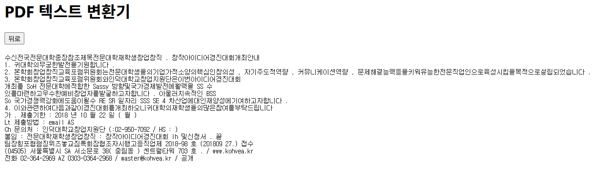
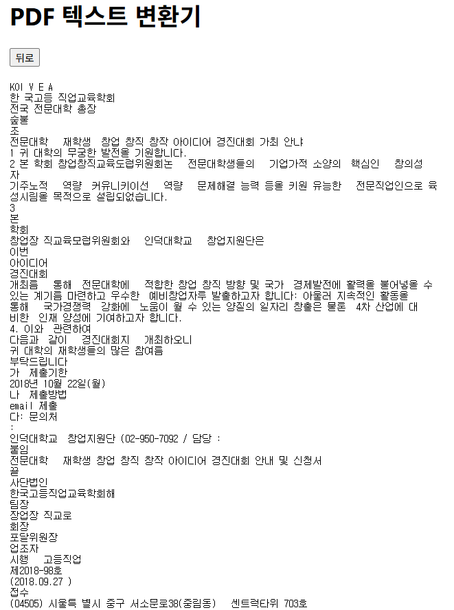
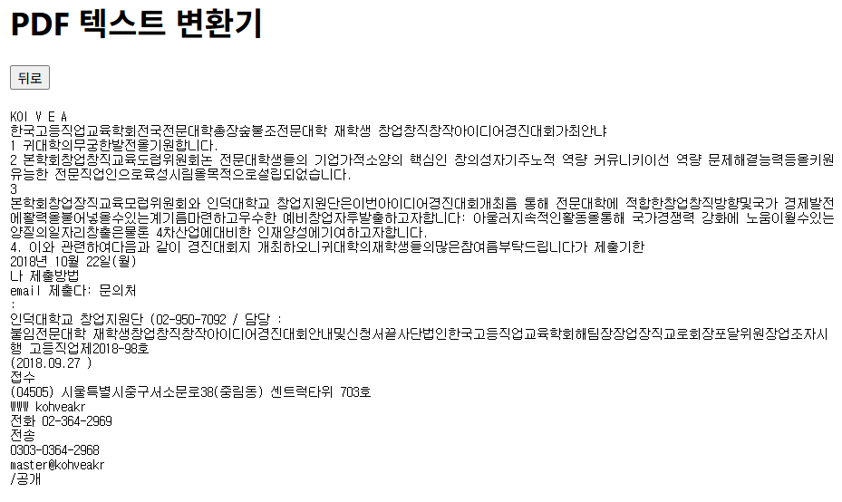
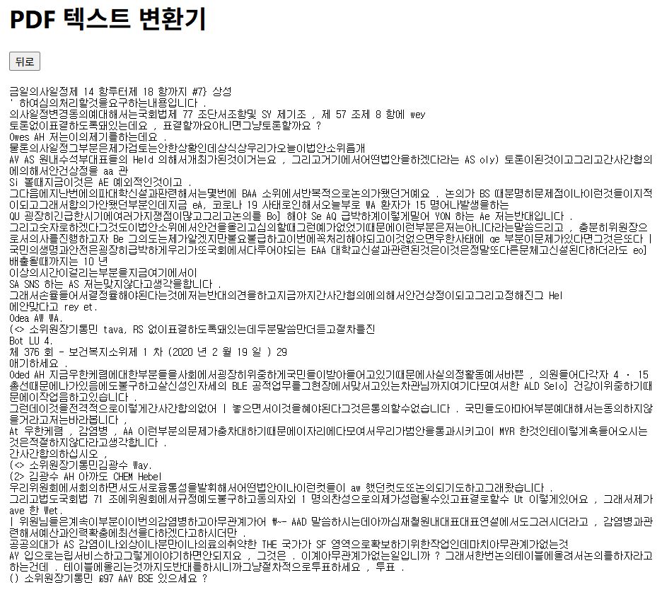
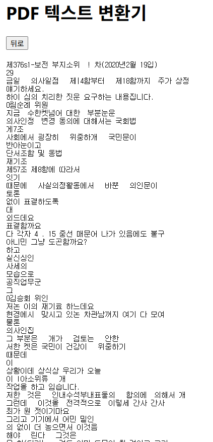
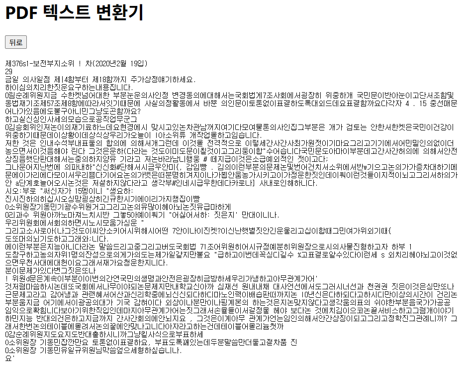

# easyocr-back


## 환경세팅

```cmd
# 가상환경 생성 (선택사항)
# 본인 gpu에 맞는 cuda -> torch -> python 버전으로 환경 설정
conda create -n env_name python=3.8 -y
# conda activate env_name
conda install pytorch=1.7.1 torchvision=0.8.2 cudatoolkit=10.2 -c pytorch -y
'''

'''
cd back
pip install -r requirements.txt
```


## 실행

```cmd
# back 디렉토리에서
python main.py # 내부 설정 포트 8001으로 실행
```

```cmd
# front 디렉토리에서
npm start
```


## pytesseract와 비교

 [한국고등직업교육학회.pdf](data\한국고등직업교육학회.pdf) 

##### pytesseract



##### EasyOCR



##### EasyOCR + 후처리




 [회의록.pdf](data\회의록.pdf) 

##### pytesseract



##### EasyOCR



##### EasyOCR + 후처리




#### 레이어 분리

pytesseract의 경우 텍스트 변환 전 레이어 분리하는 기능이 내장되어있으나, easyocr은 따로 분리해주지 않음.

pytesseract : 한글을 영어로 잘못 변환하는 부분이 많음 - 오탈자 수정으로 복구 안될듯

easyocr : 영어로 잘못 변환하는 부분은 상대적으로 적으나, 한글 오타 자체가 많음. (사실상 3~40%는 틀린듯) LLM 모델로 복구가 될지도?


그런데 gtx750 환경에서 easyocr gpu 구동이 안됨. 그래픽 메모리가 너무 적은듯

cpu만으로 돌리면 저 예시파일 한페이지 변환하는데 1분이 넘게 걸림...


gpu 사용 가능해서 시간만 적게 걸렸어도 pytesseract로 레이어 구분 후 실제 ocr은 easyocr로 기능하게 만드는것도 가능했을듯.


#### 추후 해볼것

일단 당장은 pymupdf + pytesseract로 변환 후 추가적인 후처리 과정을 거쳐야 될 것 같다.

easyocr은 하드웨어 이슈로 인해 사용 제한될듯.

다른 ocr이라고 사정이 다를까? 똑같이 안될지도


tesseract는 한글자 한글자는 비교적 정확해도 중간중간 영어로 아예 날려먹는게 치명적이고,

easyocr은 영어로는 덜바꿔먹어도 오탈자가 너무 많고 gpu 환경상 사용이 힘들다.

오탈자 너무 많으면 띄어쓰기도 교정 안될거같은데?


### 샘플데이터 이후

샘플데이터가 생각보다 깨끗하게 주어져 pymupdf만으로 대부분의 글자가 추출이 되는 상황.

새로운 샘플 데이터를 일부러 이미지화 시킨 데이터에서는 easyocr은 오탈자가 눈에 띄게 줄며 정확도가 매우 올라간 반면, pytesseract는 꾸준하게 알파벳으로 날려먹는다.

실제 ocr 수행할 환경은 easyocr이 더 좋은 성능을 보일 듯.


### 파인튜닝 시도

tuned_easyocr_fastapi 디렉토리 내부에는 주어진 샘플pdf 중 몇개를 골라 한줄씩 이미지로 나누고, 라벨링하여 만든 학습데이터로 easyocr에 파인튜닝을 시도한 잔재들이 있다.

750환경의 최대한 높은 토치 버전과 호환이 되지 않아 토치 버전을 낮춰서 easyocr을 사용하려 했는데, vram 부족으로 결국 사용하지 못하였고

여기서 토치 버전을 낮춰야한다고 잘못 판단하여 3070ti 학습 환경에서도 완전 낮은 torch를 사용하여 파인튜닝을 진행하였더니, 파인튜닝된 pth 파일이 호환성 문제로 사용할 수 없었다.

알고보니 최신 easyocr에서의 학습과 추론에는 더더욱 높은 토치 버전이 필요했는데, 750환경에서 가장 높은 토치 버전에서 호환이 되지 않는것에 매몰되어 너무나 기준을 끌어내린게 문제였다.

* 정리
750 lowtorch - 호환성 에러는 발생하지 않으나, vram부족으로 학습추론 시도하면 거부됨
750 hightorch - 호환성 에러 발생으로 실행조차 되지 않음
3070ti with 750 lowtorch - 어거지로 내부 파일을 조금 개조해서 학습은 진행됐으나, 결국 호환되지 않는 환경의 무수한 데이터타입 오류에 인해 추론에 활용하지 못함.

3070ti 환경에서 750 lowtorch에 맞춰 호환성 에러를 피하는게 아니라, 750 hightorch보다도 더 높은 torch를 사용하여 호환성 에러에 대처해야했음.
완전 최신 버전 torch로 넘어가면서 생긴 호환성 에러를 호환성 에러가 있는 중간버전보다 더 매우 낮은 버전으로 내려가서 어거지로 고쳐서 학습시켰으니,
이제와서 돌이켜보니 될리가있나! 하지만 당시에는 호환성 에러 해결에 너무 매몰돼서 저런 선택을 했었다.


### 주의사항

현재는 OCRhub 프론트엔드 사용중.
8001번 포트로 reload True 상태로 기본 실행되므로, 필요시 main.py 내부에서 변경해야함.

* **OCRhub**
  - [GitHub](https://github.com/bangtugu/OCRhub) 참조