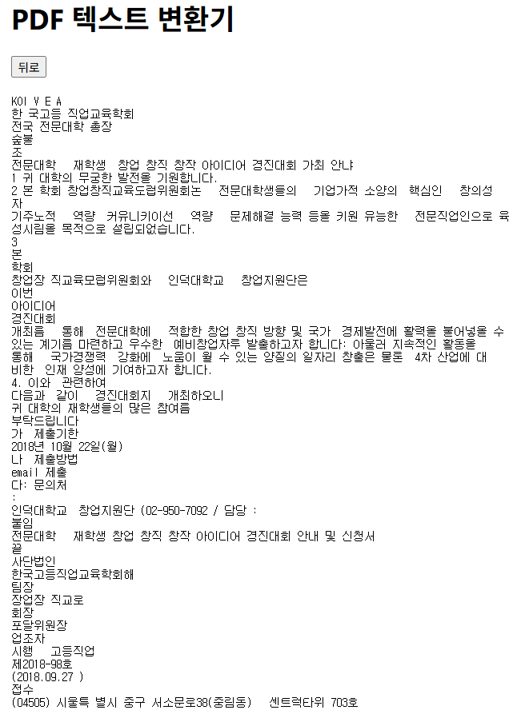

# PDFreader_with_EasyORC


## 환경세팅

```cmd
# 가상환경 생성 (선택사항)
# 본인 gpu에 맞는 cuda -> torch -> python 버전으로 환경 설정
conda create -n env_name python=3.8 -y
# conda activate env_name
conda install pytorch=1.7.1 torchvision=0.8.2 cudatoolkit=10.2 -c pytorch -y
'''

'''
cd back
pip install -r requirements.txt
cd ../front
npm install
```


## 실행

```cmd
# back 디렉토리에서
python main.py # 내부 설정 포트 8001으로 실행
```

```cmd
# front 디렉토리에서
npm start
```


## pytesseract와 비교

 [한국고등직업교육학회.pdf](data\한국고등직업교육학회.pdf) 

##### pytesseract


##### EasyOCR



##### EasyOCR + 후처리


 [회의록.pdf](data\회의록.pdf) 

##### pytesseract


##### EasyOCR


##### EasyOCR + 후처리


#### 레이어 분리

pytesseract의 경우 텍스트 변환 전 레이어 분리하는 기능이 내장되어있으나, easyocr은 따로 분리해주지 않음.

pytesseract : 한글을 영어로 잘못 변환하는 부분이 많음 - 오탈자 수정으로 복구 안될듯

easyocr : 영어로 잘못 변환하는 부분은 상대적으로 적으나, 한글 오타 자체가 많음. (사실상 3~40%는 틀린듯) LLM 모델로 복구가 될지도?


그런데 gtx750 환경에서 easyocr gpu 구동이 안됨. 그래픽 메모리가 너무 적은듯

cpu만으로 돌리면 저 예시파일 한페이지 변환하는데 1분이 넘게 걸림...


gpu 사용 가능해서 시간만 적게 걸렸어도 pytesseract로 레이어 구분 후 실제 ocr은 easyocr로 기능하게 만드는것도 가능했을듯.


#### 추후 해볼것

일단 당장은 pymupdf + pytesseract로 변환 후 추가적인 후처리 과정을 거쳐야 될 것 같다.

easyocr은 하드웨어 이슈로 인해 사용 제한될듯.

다른 ocr이라고 사정이 다를까? 똑같이 안될지도


tesseract는 한글자 한글자는 비교적 정확해도 중간중간 영어로 아예 날려먹는게 치명적이고,

easyocr은 영어로는 덜바꿔먹어도 오탈자가 너무 많고 gpu 환경상 사용이 힘들다.

오탈자 너무 많으면 띄어쓰기도 교정 안될거같은데?


네이버 ocr 돈 잘벌겠다
